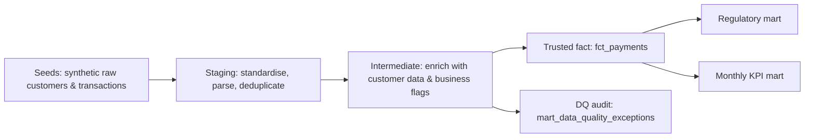

# Regulatory Payments Analytics — dbt Core + SQL
🔗 **[Open interactive dbt documentation](https://allanvissor-max.github.io/regulatory-payments-dbt/)**

[](https://github.com/allanvissor-max/regulatory-payments-dbt/actions/workflows/dbt_ci.yml)

An end-to-end analytics engineering portfolio project that demonstrates how raw payment and customer data can be transformed into trusted, documented and auditable reporting outputs.

The project is built with **dbt Core** and **SQLite** and follows a layered data architecture:

```text
Raw source data
    ↓
Staging and standardisation
    ↓
Enrichment and data-quality controls
    ↓
Trusted fact table
    ↓
Regulatory reporting, KPI and data-quality exception marts
```

## Business problem

A payments business needs reproducible monthly reporting for:

- **R1:** UK customers’ cross-currency payments where the route involves GBP
- **R2:** US customers’ cross-currency payment volume
- **R2:** US customers’ same-currency payment volume

The pipeline must make its definitions explicit, validate quality, exclude invalid records from trusted facts and keep an audit trail of every exception.

## Business context

Financial reporting cannot rely directly on raw operational data. Source records may contain missing identifiers, duplicate transactions, invalid currency routes, orphan customer references or transactions that occurred before a customer relationship began.

This project models a simplified regulatory payments reporting process. It demonstrates how those risks can be controlled before data is used for reporting.

The pipeline produces three reporting-ready outputs:

Regulatory payment volume mart — monthly payment volumes and transaction counts by reporting requirement, customer country and transaction month.
Monthly payment KPI mart — trusted-payment metrics for analytical reporting.
Data-quality exceptions mart — invalid or suspicious records retained with transparent rejection reasons for investigation.

## Architecture



## Data lineage

```text
raw_customers ──> stg_customers ──┐
                                   ├──> int_payment_enriched ──> fct_payments ──> mart_regulatory_payment_volume
raw_transactions ─> stg_transactions ┘                           └─────────────> mart_monthly_payment_kpis
                                               └──────────────────────────────────> mart_data_quality_exceptions
```

##  What this project demonstrates
- Layered dbt architecture: raw → staging → intermediate → marts
- SQL-based data transformation and modelling
- Standardisation of raw identifiers, dates, monetary amounts and currency routes
- Parsing semi-structured currency-route data into reusable attributes
- Customer and transaction data integration
- Duplicate detection using window functions
- Reusable data-quality flags and business-rule validation
- Controlled separation of trusted records and rejected records
- Custom dbt tests alongside standard tests such as not_null and unique
- dbt documentation, lineage and column-level metadata
- Git version control and automated CI validation through GitHub Actions
- Data-quality approach

## Data Quality Approach
Invalid records are not silently deleted.

Each transaction is evaluated against technical and business validation rules, including:
- missing transaction ID;
- duplicate transaction ID;
- invalid or missing transaction date;
- missing or non-numeric amount;
- invalid currency route;
- customer reference not found in the customer source;
- transaction date before customer onboarding date.

Records that pass all checks are loaded into the trusted fct_payments table.

Records that fail one or more checks are routed to mart_data_quality_exceptions, where the exact exception reason is preserved. This makes the reporting process transparent and supports investigation, remediation and auditability.

## Showcase

1. Open **dbt docs** and show the lineage graph.
2. Open `models/marts/mart_regulatory_payment_volume.sql` and explain the business rules.
3. Open `models/marts/mart_data_quality_exceptions.sql` and demonstrate that invalid data is surfaced, not hidden.
4. Run `dbt build` and show the automated test results.
5. Open `.github/workflows/dbt_ci.yml` and explain that the quality gate runs on every GitHub push or pull request.

## Walkthrough

See [`SHOWCASE_SCRIPT.md`](SHOWCASE_SCRIPT.md) for a concise 90-second project demo.

## Expected project outputs

- `fct_payments`: trusted transaction-level payments
- `mart_regulatory_payment_volume`: monthly regulated payment volume
- `mart_monthly_payment_kpis`: operational payment KPIs by country
- `mart_data_quality_exceptions`: rejected rows with clear reasons

**Data note:** all CSV data is synthetic. The project intentionally includes a few bad records so that the data-quality workflow is visible rather than theoretical.

## Tech stack

`dbt Core` · `dbt-sqlite` · `SQLite` · `SQL` · `Git` · `GitHub Actions`
