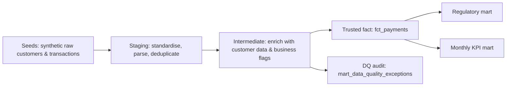

# Regulatory Payments Analytics — dbt + SQL
🔗 **[Open interactive dbt documentation](https://allanvissor-max.github.io/regulatory-payments-dbt/)**

[](https://github.com/allanvissor-max/regulatory-payments-dbt/actions/workflows/dbt_ci.yml)

# Regulatory Payments dbt Project

An end-to-end analytics engineering portfolio project that demonstrates how raw payment and customer data can be transformed into trusted, documented and auditable reporting outputs.

The project is built with **dbt Core** and **SQLite** and follows a layered data architecture:

```text
Raw source data
    ↓
Staging and standardisation
    ↓
Enrichment and data-quality controls
    ↓
Trusted fact table
    ↓
Regulatory reporting, KPI and data-quality exception marts
```

## Business problem

A payments business needs reproducible monthly reporting for:

- **R1:** UK customers’ cross-currency payments where the route involves GBP
- **R2:** US customers’ cross-currency payment volume
- **R2:** US customers’ same-currency payment volume

The pipeline must make its definitions explicit, validate quality, exclude invalid records from trusted facts and keep an audit trail of every exception.

## Business context

Financial reporting cannot rely directly on raw operational data. Source records may contain missing identifiers, duplicate transactions, invalid currency routes, orphan customer references or transactions that occurred before a customer relationship began.

This project models a simplified regulatory payments reporting process. It demonstrates how those risks can be controlled before data is used for reporting.

The pipeline produces three reporting-ready outputs:

Regulatory payment volume mart — monthly payment volumes and transaction counts by reporting requirement, customer country and transaction month.
Monthly payment KPI mart — trusted-payment metrics for analytical reporting.
Data-quality exceptions mart — invalid or suspicious records retained with transparent rejection reasons for investigation.

## Architecture



## Data lineage

```text
raw_customers ──> stg_customers ──┐
                                   ├──> int_payment_enriched ──> fct_payments ──> mart_regulatory_payment_volume
raw_transactions ─> stg_transactions ┘                           └─────────────> mart_monthly_payment_kpis
                                               └──────────────────────────────────> mart_data_quality_exceptions
```

## Key design choices

| Area | Implementation |
|---|---|
| Modelling | Layered `raw → staging → intermediate → marts` design |
| Reusability | `source()` at entry point and `ref()` for all model dependencies |
| Data quality | Standard dbt tests plus two custom generic tests |
| Auditability | Bad rows appear in `mart_data_quality_exceptions` with a human-readable reason |
| Reporting definition | The reporting period is **2022-04-01 inclusive to 2023-08-01 exclusive** |
| Amounts | Refunds may be negative in `signed_amount_gbp`; reporting volume uses `abs(amount_gbp)` |
| Deployment | GitHub Actions runs `dbt seed`, `dbt build` and `dbt docs generate` on every push or pull request |

## Run locally on Windows

### 1. Create and activate a virtual environment

```powershell
py -m venv .venv
.\.venv\Scripts\Activate.ps1
pip install -r requirements.txt
```

### 2. Set the local SQLite paths

```powershell
$env:DBT_SQLITE_MAIN_DB = "$PWD\data\warehouse.db"
$env:DBT_SQLITE_SCHEMA_DIR = "$PWD\data"
```

### 3. Validate, build and test

```powershell
dbt debug --profiles-dir .
dbt seed --full-refresh --profiles-dir .
dbt build --profiles-dir .
dbt docs generate --profiles-dir .
dbt docs serve --profiles-dir .
```

Or run the included script:

```powershell
.\scripts\run_local.ps1
```

## What to show

1. Open **dbt docs** and show the lineage graph.
2. Open `models/marts/mart_regulatory_payment_volume.sql` and explain the business rules.
3. Open `models/marts/mart_data_quality_exceptions.sql` and demonstrate that invalid data is surfaced, not hidden.
4. Run `dbt build` and show the automated test results.
5. Open `.github/workflows/dbt_ci.yml` and explain that the quality gate runs on every GitHub push or pull request.

## Walkthrough

See [`SHOWCASE_SCRIPT.md`](SHOWCASE_SCRIPT.md) for a concise 90-second project demo.

## Expected project outputs

- `fct_payments`: trusted transaction-level payments
- `mart_regulatory_payment_volume`: monthly regulated payment volume
- `mart_monthly_payment_kpis`: operational payment KPIs by country
- `mart_data_quality_exceptions`: rejected rows with clear reasons

**Data note:** all CSV data is synthetic. The project intentionally includes a few bad records so that the data-quality workflow is visible rather than theoretical.

## Tech stack

`dbt Core` · `dbt-sqlite` · `SQLite` · `SQL` · `Git` · `GitHub Actions`
